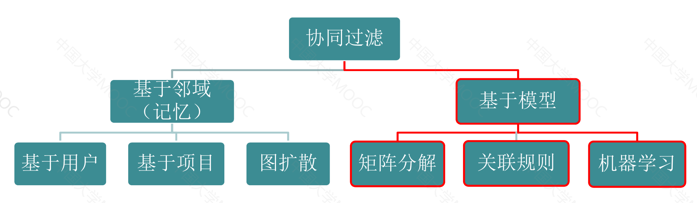
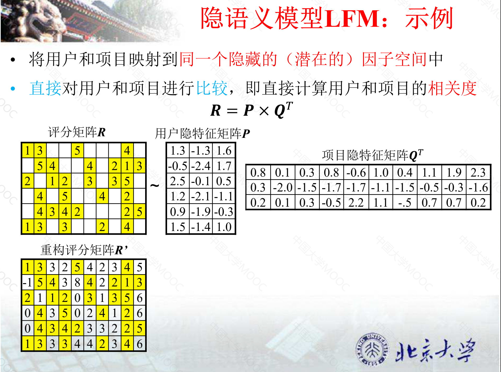
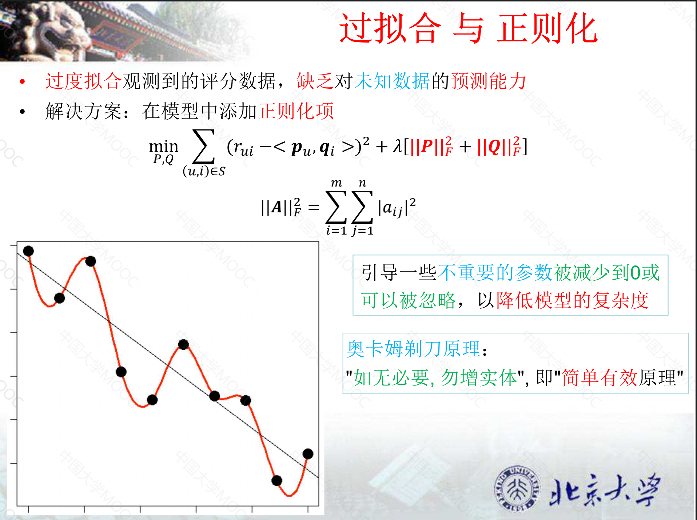
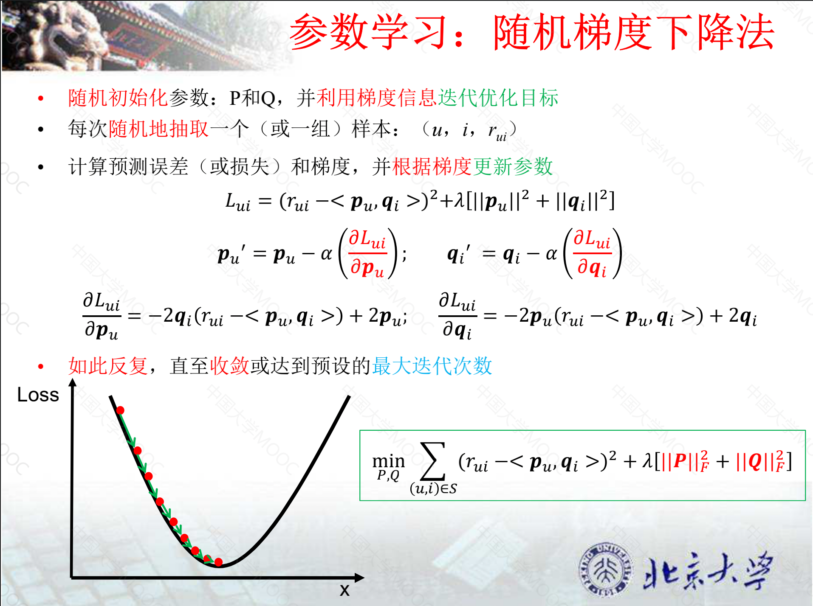
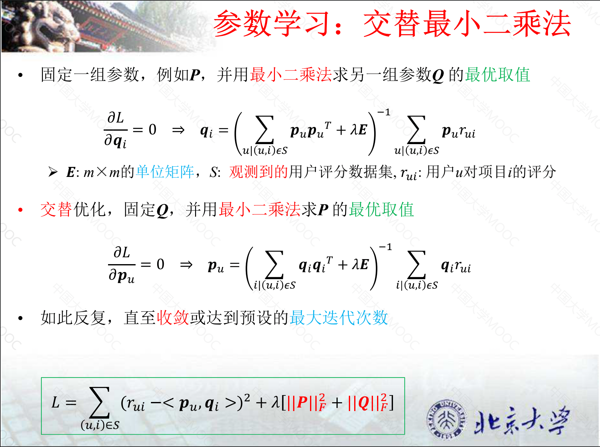

# 3.基于模型的协同过滤

## 3.1 基于关联规则的推荐

### 3.1.1 关联规则
关联:
- 自然界中两个事件同时或先后发生的一种联系
- 可分为：简单关联、时序关联、因果关联

关联规则：
- 描述在交易中项目之间同时出现的规律的知识模式
- 通过量化的数字描述项目A 的出现对项目B的出现有多大的影响
- 形如A二B的蕴含式，A和B为不相交的项集，例：{尿布}->{啤酒}

### 3.1.2 基本概念

全项集：$I=\{ i_1,i_2,i_3,......,i_m\}$  
事务：$T \subset I$，一组关联的项目，可以认为是同一用户购买/点击的项目  
关联规则：$ A \Longrightarrow B$并且$A \subset I,B \subset I, A \cap B = \varnothing $

### 3.1.3 关联规则度量

置信度：$confidence(A \Longrightarrow B)$
- 数据集D中同时包含项集A和B的事务数与包含项集A的事务数的比值

$$
confidence(A \Longrightarrow B) = P(B|A) = \frac{| \{T \in D | A \cup B \subset T \} |}{| \{ T \in D | A \subset T \}|}
$$

支持度：$support(A \Longrightarrow B)$
- 支持度是对关联规则重要性的衡量，反映关联是否是普遍存在的规律
- 数据集D中同时包含项集A和B的事务数与总的事务数的比值

$$
support(A \Longrightarrow B) = P(B \cup A) = \frac{| \{T \in D | A \cup B \subset T \} |}{| \{ D \}|}
$$

## 3.2 基于矩阵分解的评分预测

### 3.2.1 矩阵分解

基本假设:
- 基于观察到的所有用户历史行为数据
- 可以推测出用户和项目的潜在特征表示（画像）

基本思想:
- 将历史行为数据表示为矩阵：隐式反馈矩阵 vS 评分矩阵
- 通过矩阵分解挖掘（学习）用户和项目的潜在表示，降低数据维度

### 3.2.2 SVD奇艺值分解(Singular Value Decomposition) 
SVD是线性代数中的一种矩阵分解技术，任何一个$m \times n$的矩阵$R$都可以分解成三个矩阵$U、\sum、V$的乘积:
$$
R_{m \times n} = U_{m \times m} \times {\sum}_{m \times n} \times V_{n \times n}^{T}
$$
- $U$和$V$分别是$m \times m$和$n \times n$的正交矩阵
- $\sum$是$m \times n$的对角矩阵，对角元素为矩阵$R$的奇异值(从大到小排列)

矩阵降维:
- 利用SVD分解之后，若只保留前$k$个最大的奇异值，则就可以实现对矩阵的降维
- 利用前$k$个奇异值和对应特征向量所包含的信息来近似的描述还原矩阵$R$

$$
R_{m \times n} = U_{m \times m} \times {\sum}_{m \times n} \times V_{n \times n}^{T} \Longrightarrow R_{m \times n} \approx U_{m \times k} \times {\sum}_{k \times k} \times V_{n \times k}^{T}
$$

### 3.2.3 隐语义模型LFM
动机:
- SVD分解需要知道完整的矩阵信息
- 当矩阵的数据（信息）不完整时，传统SVD分解无法直接应用
- 用户评分行为是稀疏的，存在大量的缺失值

理论依据:  
- 对于任意的$m \times n$的矩阵$R$，存在如下的分解
$$ R_{m \times n}=X_{m \times k}Y_{n \times k}^{T} $$
其中$X$是$m \times k$的矩阵，$Y$是$n \times k$的矩阵，$k$表示矩阵$R$的秩

基本思想：
- 将用户和项目映射到同一个隐藏的（潜在的）因子空间中
- 直接对用户和项目进行比较，即直接计算用户和项目的相关度

示例

目标函数:最小化平方误差
$$
Loss = min_{P,Q} \sum_{(u,i) \in S}(r_{ui}-<p_u,q_i>)
$$
这里的$r_{ui}$表示观测到的用户$u$对项目$i$的评分 $r^{\land}_{ui}=<p_u,q_i>$表示模型对用户$u$对项目$i$的预估值 $S$为收集到的用户的评分数据集 

过拟合与正则化

参数学习
- 随机梯度下降法 
- 交替最小二乘法 

## 3.3 概率矩阵分解框架

## 3.4 基于矩阵分解的Top-N推荐