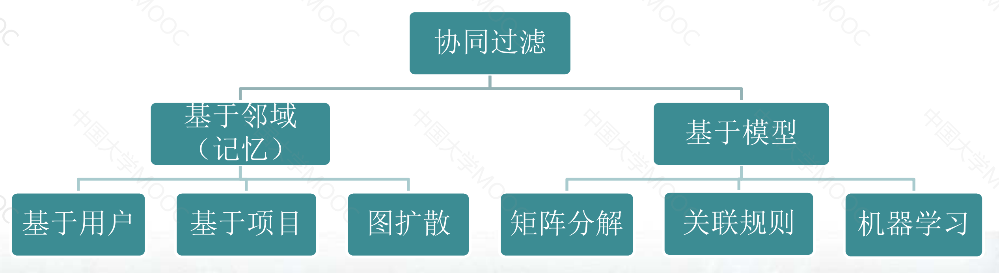
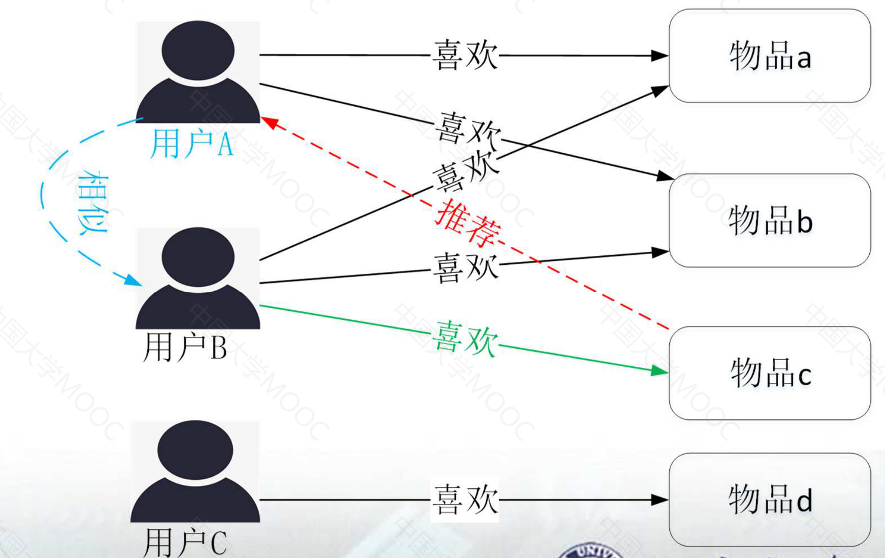
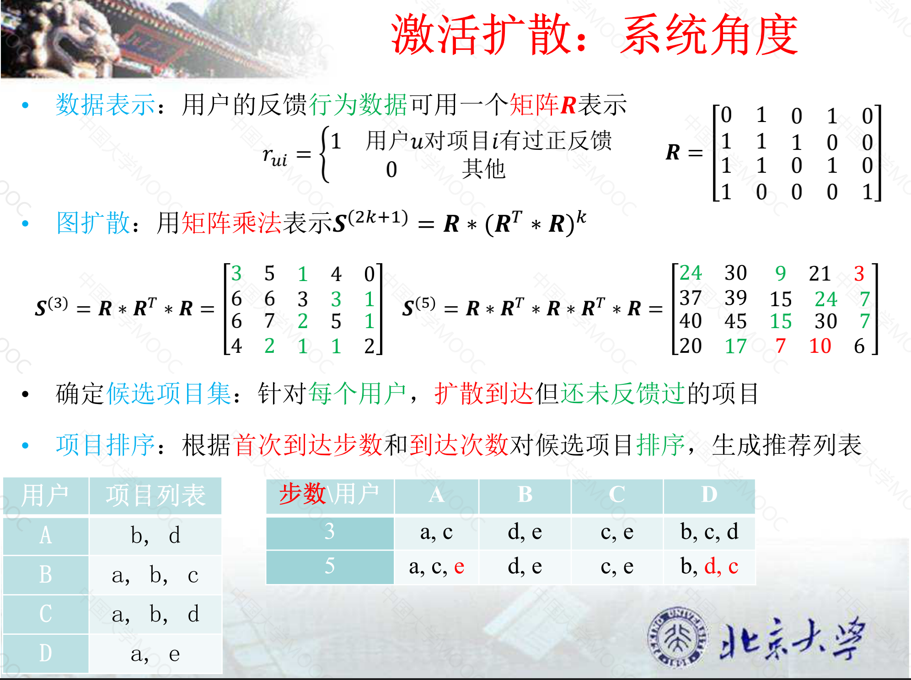
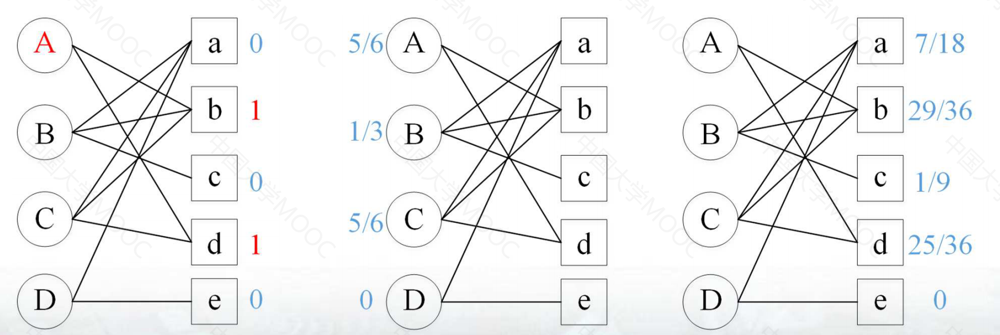
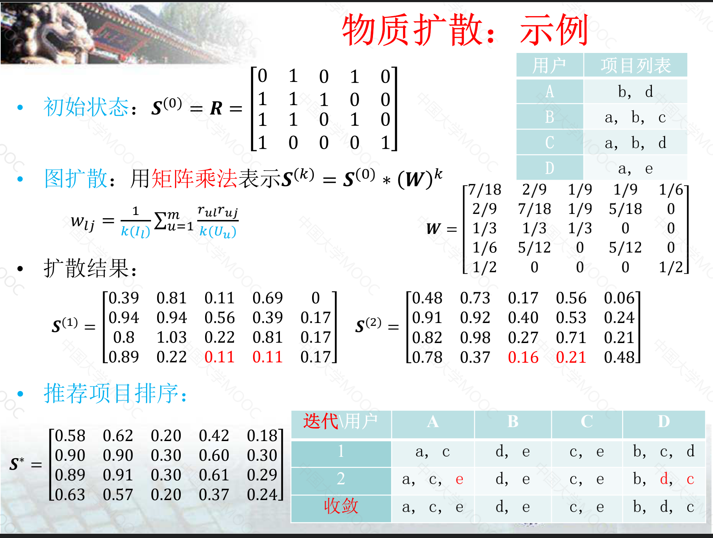

# 2.基于邻域的协调过滤

## 2.1 协同过滤的基本思想与算法分类

### 2.1.1 经典系统

1992年：Tapestry系统是公开的最早的应用CF进行信息过滤的系统
- 施乐公司为解决其Palo Alto研究中心内部的资讯过载问题
- 利用其他用户的显式反馈(标注是否有用)，帮助用户过滤新闻组邮件

1994年：基于协同过滤CF的跨网络新闻推荐系统GroupLens
- 由MIT和明尼苏达大学共同推出
- 根据相似用户对新闻的评分（1分~5分）预测目标用户对新闻的评分并做出推荐

其他不同领域的协同过滤系统
- 电影推荐MovieLens
- 音乐推荐Ringo
- 书籍（商品）推荐Amazon

### 2.1.2 协调过滤的基本思想
- 利用集体智慧，借鉴相关人群的观点进行推荐
- 假设过去兴趣相似的用户在未来的兴趣也会相似
- 假设相似的用户会产生相似的历史行为数据

### 2.1.3 算法分类

基于协调过滤的算法主要分为了两大类，分别为：基于领域的模型与基于模型的模型

| 基于领域       | 基于模型    |
|------------|---------|
| 利用局部（邻域）信息 | 基于全局信息  |
| 基于统计的方法 | 训练出抽象模型 |

更一般的基于邻域的模型与基于模型的模型可以进一步细分

### 2.1.4 协调过滤的一般步骤
- 收集可以反应用户偏好的行为数据
  - 显式反馈：用户主动的向系统表达其偏好，一般需要用户在消费完项目后进行额外的反馈，例如打分等
  - 隐式反馈：隐含用户对项目偏好的行为数据，是用户在探索或消费项目过程中的正常操作，例如点击、收藏等
- 寻找邻域：寻找相似的用户（项目）
- 计算推荐结果：根据邻域信息来计算推荐结果

## 2.2 基于用户的协调过滤

### 2.2.1 基本思想
- 基于用户对项目的历史偏好找到相邻（相似）的用户
- 将邻居（相似）用户喜欢的项目推荐给当前用户

关键是两步:
- 寻找相似用户
- 用户相似度度量方法

### 2.2.2 用户相似度计算

设$N(u)$为用户$u$有过正反馈的项目集合 
设$N(v)$为用户$v$有过正反馈的项目集合 
则用户$u$和用户$v$的兴趣相似度为:
- $Jaccard$公式: $sim_{uv}=\frac{|N(u) \cap N(v)|}{|N(u) \cup N(v)|}$
- 余弦相似度公式：$sim_{uv}=\frac{|N(u) \cap N(v)|}{\sqrt{|N(u) \cup N(v)|}}$

### 2.2.3 兴趣度预测

计算用户$u$对邻域用户购买过的项目$i$的感兴趣程度$p(u,i)$  
输入：
- $S(u,K)$：表示和用户$u$最相似的$K$个用户（K-近邻）
- $w_{uv}$：表示用户$u$和用户$v$的兴趣相似度
- $r_{v,i}$：表示观测到的用户$v$对项目$i$的兴趣度（有正反馈为1，否则为0）

输出:
- 兴趣度：邻域用户的兴趣度的加权求和
$$
p(u,i) = \sum_{v \in S(u,K)} sim_{uv} * r_{vi}
$$
### 2.2.4 基于User-CF的推荐系统

离线预处理
- 计算用户之间的相似度矩阵
- 根据用户相似度矩阵确定每个用户的邻域（K近邻）

在线推荐：针对当前活跃用户$u$，计算推荐列表
- 确定候选的项目集：$ C(u)= \{ i|i \notin N(u) \& i \in N(v) \& v \in S(u,K) \} $
- 预测兴趣度并生成推荐列表：$p(u,i) = \sum_{v \in S(u,K) \cap N(i)} sim_{uv} * r_{vi}$

### 2.2.5 用户相似度改进：IUF

基本思想：
- 惩罚热门项目
- 两个用户对冷门项目有过相同的行为更能说明它们的兴趣相似

计算：
- 惩罚系数：$f_{i}=log(n/n_{i})$
- $n$表示总用户数，$n_i$表示对项目$i$有过正反馈的用户数
- 则新的用户相似度计算公式为

$$
sim_{uv}=\frac{ \sum_{ i \in N(u) \cap N(v) } log\frac{n}{n_i}} {|N(u) \cup N(v)|}
$$

### 2.2.6 User-CF的缺点
- 难以形成有意义的邻域集合
  - 很多用户两两之间只有很少的共同反馈
  - 而仅有的共同反馈的项目，往往是热门项目（缺乏区分度）
- 随着用户行为数据的增加，用户之间的相似度可能变化的很快
  - 离线算法难以瞬间更新推荐结果

## 2.3 基于项目的协同过滤

### 2.3.1 基本思想

- 基于用户对项目的反馈（偏好）寻找相似（相关）的项目
- 根据用户的历史反馈（偏好）行为，给他推荐相似的项目

关键是两步：
- 寻找相似（相关）项目（Item）
- 项目相似度度量方法

### 2.3.2 项目相似度度量方法

设$N(i)$为项目$i$有过正反馈的用户集合 
设$N(j)$为项目$j$有过正反馈的用户集合 
则项目$i$和项目$j$的相似度为:
- $Jaccard$公式: $sim_{ij}=\frac{|N(i) \cap N(j)|}{|N(i) \cup N(j)|}$
- 余弦相似度公式：$sim_{ij}=\frac{|N(i) \cap N(j)|}{\sqrt{|N(i) \cup N(j)|}}$
- 条件概率相似度：$sim_{ij} = P(j|i) = \frac{|N(i) \cap N(j)|}{|N(i)|} $

### 2.3.3 兴趣度预测

计算用户$u$对候选项目$i$的感兴趣程度$p(u,i)$  
输入：
- $S(i,K)$：表示和项目$i$最相似的$K$个项目（K-近邻）
- $N(u)$：表示与用户$u$有过正反馈的项目集
- $sim_{ij}$：表示项目$i$和项目$j$的兴趣相似度
- $r_{uj}$：表示观测到的用户$u$对项目$j$的兴趣度（有正反馈为1，否则为0）

输出:
- 兴趣度：邻域用户的兴趣度的加权求和
$$
p(u,i) = \sum_{j \in N(u)} sim_{ij} * r_{uj}
$$

### 2.3.4 基于Item-CF的推荐系统

离线预处理
- 计算项目之间的相似度矩阵
- 根据用户相似度矩阵确定每个项目的邻域（K近邻）

在线推荐：针对当前活跃用户$u$，计算推荐列表
- 确定候选的项目集：$ C(u)= \{ i|i \notin N(u) \& i \in N(v) \& v \in S(u,K) \} $
- 预测兴趣度并生成推荐列表：$p(u,i) = \sum_{j \in N(u)} sim_{ij} * r_{uj}$

### 2.3.5 项目相似度改进

惩罚活跃用户
- 基本思想：越活越的用户，其对项目相似度的贡献越小
- 惩罚系数：$f_{u}=log(m/m_u)$，其中$m$表示总项目数，$m_u$表示用户$u$有过正反馈（例如：购买过）的项目数
- 修正$Jaccard$相似度

$$
sim_{ij}=\frac{ \sum_{ u \in N(i) \cap N(j) } log\frac{m}{m_u}} {|N(i) \cup N(j)|}
$$

惩罚热门项目
- 修正后的条件概率相似度为：

$$
sim_{ij} = P(j|i) = \frac{|N(i) \cap N(j)|}{|N(i)||N(j)|^{\alpha}}
$$
其中$\alpha$的取值范围为$[0,1]$这样就可以对热门的项目进行打压了

## 2.4 基于邻域的评分预测

### 2.4.1 评分预测
- 输入：用户对项目的显式评分
- 输出：预测用户对未知项目的评分

### 2.4.2 协同过滤的一般步骤
- 收集数据
- 寻找邻域（计算Item-Item/User-User相似度矩阵）
- 计算推荐结果

这里针对User-CF域Item-CF有着不同的计算方法
- User-CF

$$
r_{ui} = \frac{ \sum_{v \in N_{i}(u) }sim_{uv}r_{vi} }{ \sum_{v \in N_{i}(u)}|sim_{uv}| }
$$

- Item-CF

$$
r_{ui} = \frac{ \sum_{j \in N_{u}(i) }sim_{ij}r_{uj} }{ \sum_{j \in N_{u}(i)}|sim_{ij}| }
$$

核心：不管是Item-CF还是User-CF都是相当于对其邻域物料（用户/项目）对目标项目评分的加权平均值

## 2.5 基于二部图的协同过滤

### 2.5.1 传统邻域方法的缺点

- 范围限制问题
  - 只考虑和用户有过共同评价（或购买）项目的相邻用户
- 计算空间复杂度较大
  - 需在内存里面保存$O(N^2)$的相似度矩阵
- 数据稀疏/冷启动问题
  - 用户一般只会评价（或购买）少量项目

### 2.5.2 基于二部图的协同过滤

- 隐式反馈数据集：$(u,i)$二元组集合（点击/购买）
- 用户行为可以表示为（二部）图的形式
  - 不相交的两个顶点子集：$U$和$I$（用户集合和项目集）
  - 每条边$(u,i)$管理的两个顶点$u$和$i$属于两个不同的顶点子集$(u /in U,i /in I)$
- 推荐类型：Top-N推荐

### 2.5.3 激活扩散
假设：
- 用户反馈过的项目都具有用户偏好的某种属性
- 用户偏好可以在图中节点间传递

基本思想：
- 根据用户偏好的传递性来挖掘用户潜在偏好信息
- 标准的协同过滤（User-CF）：路径长度=3，$U-I-U-I$
- 扩展路径长度，例如：路径长度=5：$U-I-U-I-U-I$

图扩散：
- 从目标节点出发，沿图中边进行扩散
- 直至达到给定的最大扩散步长

确定候选项目集：
- 扩散过程中到达过的所有项目，去除与用户有过正反馈的项目

项目排序：
- 排序依据：首次到达步数和到达次数
- 如果首次到达的步数相同，则根据$k$步到达次数做进一步排序

例子：

### 2.5.4 物质扩散

假设：
- 扩散过程中每条边的影响不完全相同
- 可避免活跃用户或热门项目偏置的问题

基本思想：
- 将用户的偏好属性表示为节点所拥有的资源（或能量）
- 每个节点平均地将自己拥有的物质分享给相邻的节点，满足守恒律

主要步骤：针对给定目标用户
- 资源初始化分配：有过正反馈的所有项目节点分配一个资源
- 资源扩散：根据邻接关系，按照平均分配的方式迭代传递
- 生成推荐列表：依据资源拥有量从大到小对候选项目进行排序

具体做法
- 矩阵表示：用户的反馈行为数据可用矩阵R表示

$$
    r_{ui}=\begin{cases}
          1& \text{用户u对项目i有过正反馈}\\
          0& \text{其他}
          \end{cases}
$$

- 图扩散：用矩阵乘法表示$S^{(k)} = S^{(0)}*(W)^k$
  - 资源分配初始化：$S^{(0)} = R$
  - $w_{lj}$表示第一轮迭代$(U-I-U)$从项目节点$l$转移到项目节点$j$上的比例 $w_{lj} = \frac{1}{k(I_j)} \sum_{u=1}^{m} \frac{r_{ul}r_{uj}}{k(U_u)} $
  - $U-I$扩散：每个项目节点把自己的资源平均分配给与其相邻的用户：$ b_u = \sum_{j=1}^{n} r_{uj} \frac{s_{uj}}{k(I_j)}$
  - $I-U$扩散：每个用户节点把自己的资源平均分配给与其相邻的项目：$ s^{,}_{uj} = \sum{u=1}^{m}r_{uj} \frac{b_{u}}{k(U_u)} = \sum_{j=1}^{n}s_{uj}w_{lj} $
  - 从上述式子可以看出 $S^{(k)} = S^{(0)}*(W)^k$ 的推导过程，所以我们的核心就是计算出$W$即可

例子：

## 2.6 代码实践

