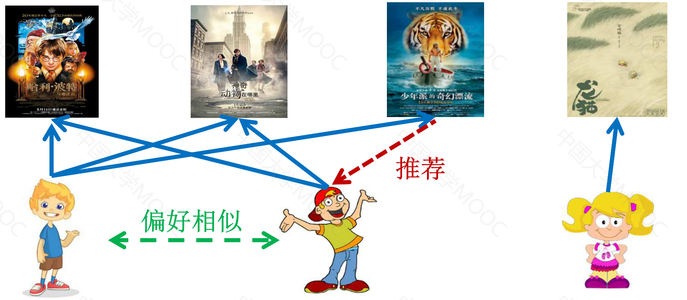

# 2.基于邻域的协调过滤

## 2.1 协同过滤的基本思想与算法分类

### 2.1.1 经典系统

1992年：Tapestry系统是公开的最早的应用CF进行信息过滤的系统
- 施乐公司为解决其Palo Alto研究中心内部的资讯过载问题
- 利用其他用户的显式反馈(标注是否有用)，帮助用户过滤新闻组邮件

1994年：基于协同过滤CF的跨网络新闻推荐系统GroupLens
- 由MIT和明尼苏达大学共同推出
- 根据相似用户对新闻的评分（1分~5分）预测目标用户对新闻的评分并做出推荐

其他不同领域的协同过滤系统
- 电影推荐MovieLens
- 音乐推荐Ringo
- 书籍（商品）推荐Amazon

### 2.1.2 协调过滤的基本思想
- 利用集体智慧，借鉴相关人群的观点进行推荐
- 假设过去兴趣相似的用户在未来的兴趣也会相似
- 假设相似的用户会产生相似的历史行为数据

### 2.1.3 算法分类

基于协调过滤的算法主要分为了两大类，分别为：基于领域的模型与基于模型的模型

| 基于领域       | 基于模型    |
|------------|---------|
| 利用局部（邻域）信息 | 基于全局信息  |
| 基于统计的方法 | 训练出抽象模型 |

更一般的基于邻域的模型与基于模型的模型可以进一步细分

### 2.1.4 协调过滤的一般步骤
- 收集可以反应用户偏好的行为数据
  - 显式反馈：用户主动的向系统表达其偏好，一般需要用户在消费完项目后进行额外的反馈，例如打分等
  - 隐式反馈：隐含用户对项目偏好的行为数据，是用户在探索或消费项目过程中的正常操作，例如点击、收藏等
- 寻找邻域：寻找相似的用户（项目）
- 计算推荐结果：根据邻域信息来计算推荐结果

## 2.2 基于用户的协调过滤

### 2.2.1 基本思想
- 基于用户对项目的历史偏好找到相邻（相似）的用户
- 将邻居（相似）用户喜欢的项目推荐给当前用户

关键是两步:
- 寻找相似用户
- 用户相似度度量方法

### 2.2.2 用户相似度计算

设$N(u)$为用户$u$有过正反馈的项目集合 
设$N(v)$为用户$v$有过正反馈的项目集合 
则用户$u$和用户$v$的兴趣相似度为:
- $Jaccard$公式: $sim_{uv}=\frac{|N(u) \cap N(v)|}{|N(u) \cup N(v)|}$
- 余弦相似度公式：$sim_{uv}=\frac{|N(u) \cap N(v)|}{\sqrt{|N(u) \cup N(v)|}}$

### 2.2.3 兴趣度预测

计算用户$u$对邻域用户购买过的项目$i$的感兴趣程度$p(u,i)$  
输入：
- $S(u,K)$：表示和用户$u$最相似的$K$个用户（K-近邻）
- $w_{uv}$：表示用户$u$和用户$v$的兴趣相似度
- $r_{v,i}$：表示观测到的用户$v$对项目$i$的兴趣度（有正反馈为1，否则为0）

输出:
- 兴趣度：邻域用户的兴趣度的加权求和
$$
p(u,i) = \sum_{v \in S(u,K)} sim_{uv} * r_{vi}
$$
### 2.2.4 基于User-CF的推荐系统

离线预处理
- 计算用户之间的相似度矩阵
- 根据用户相似度矩阵确定每个用户的邻域（K近邻）

在线推荐：针对当前活跃用户$u$，计算推荐列表
- 确定候选的项目集：$ C(u)= \{ i|i \notin N(u) \& i \in N(v) \& v \in S(u,K) \} $
- 预测兴趣度并生成推荐列表：$p(u,i) = \sum_{v \in S(u,K) \cap N(i)} sim_{uv} * r_{vi}$

### 2.2.5 用户相似度改进：IUF

基本思想：
- 惩罚热门项目
- 两个用户对冷门项目有过相同的行为更能说明它们的兴趣相似

计算：
- 惩罚系数：$f_{i}=log(n/n_{i})$
- $n$表示总用户数，$n_i$表示对项目$i$有过正反馈的用户数
- 则新的用户相似度计算公式为

$$
sim_{uv}=\frac{ \sum_{ i \in N(u) \cap N(v) } log\frac{n}{n_i}} {|N(u) \cup N(v)|}
$$

### 2.2.6 User-CF的缺点
- 难以形成有意义的邻域集合
  - 很多用户两两之间只有很少的共同反馈
  - 而仅有的共同反馈的项目，往往是热门项目（缺乏区分度）
- 随着用户行为数据的增加，用户之间的相似度可能变化的很快
  - 离线算法难以瞬间更新推荐结果

## 2.3 基于项目的协同过滤

## 2.4 基于邻域的评分预测

## 2.5 基于二部图的协同过滤

