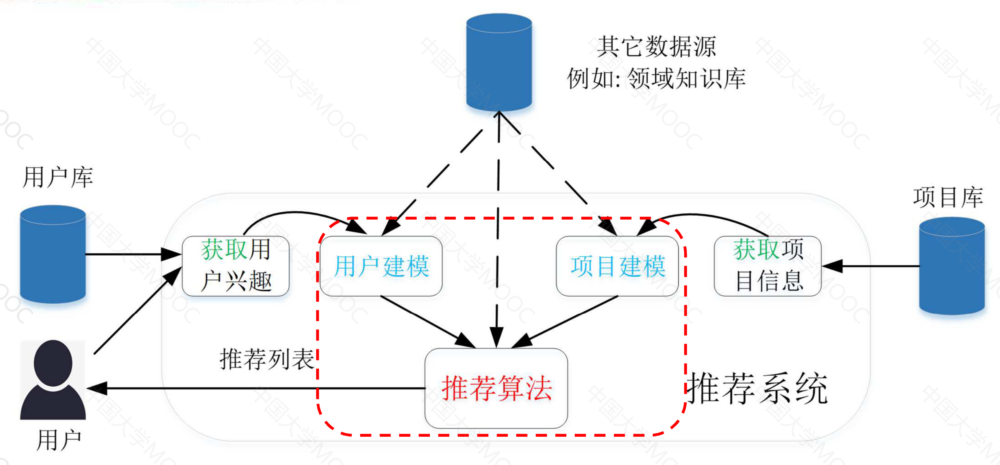

# 1. 推荐系统简介 {docsify-ignore}

## 1.1 推荐系统的意义与价值

### 1.1.1 为什么要学推荐系统
- 利用推荐系统可以解决实际应用难题
- 使得平台、用户、供应商等多方收益

### 1.1.2 发展背景
- 互联网技术迅猛发展->信息爆炸->信息超载
- 互联网上的物品普遍存在**长尾**(long tail)现象

### 1.1.3 推荐系统
- 一种主动的**信息过滤**系统
  - 将信息过滤过程由"用户主动搜索"转变为"系统主动推送"
- 一种个性化的**双边匹配**系统
  - 帮助用户发现其所**喜好的或所需**的小众、非主流的商品
  - 帮助用户将其**商品展现**在对它们感兴趣的用户面前

### 1.1.4 推荐系统的价值
- 从**平台**的角度
  - 帮助其提高用户的满意度和忠诚度，同时给其带来丰厚的收益
- 从**用户**的角度
  - 帮助其解决信息超载的问题，提高其决策效率，提升其辛福感
- 从**供应商**的角度
  - 帮助其进行精准的商品推销，提高销售量，降低营销成本
- 从**行业**的角度
  - 帮助其更加多元化、健康的发展，帮助尾部商家得意生存和发展

## 1.2 推荐系统的历史与框架

### 1.2.1 推荐系统的发展历史
- 1992：Xerox公司开发出基于协同过滤的内部新闻组文档推荐系统Tapestry
- 1994：MIT和明尼苏达大学推出基于协同过滤的跨网络新闻推荐GroupLens
- 1998：Amazon推出基于项目的协同过滤算法，实现个性化的线上商品推荐
- 2003：Google开创AdWords盈利模式，根据用户搜索关键词推荐相关广告
- 2007：Google为AdWords添加了个性化元素
- 2006~2009：Netflix主办百万美金大奖赛，将其电影推荐准确率提高10%
- 个性化推荐在音乐，求职等诸多领域得到了成果的应用，并慢慢成为了各种互联网应用的一种标配

### 1.2.2 个性化推荐系统框架

#### 1.2.2.1 个性化推荐
个性化推荐需要学习一个映射函数:$ f:U \times I \rightarrow R$
 这里的输入分别代表:
- **用户画像**($U$):评分、偏好、人口统计学资料、上下文等
- **项目画像**($I$):项目描述(属性)、内容等

这里需要根据输入的$U,I$来计算用户的兴趣度或相关度来用于排序，最终更加输出的结果针对每个用户给出排序的列表

#### 1.2.2.2 用户画像（User）

用户画像主要根据用户的**特点**与**兴趣**进行建模
- 从用户相关的各种数据中挖掘或抽取出用户在不同属性上的标签
- 例如：年来、性别、职业、婚姻状态、兴趣、未来可能的行为等

用户画像构建的主要过程
- 标签体系的构建：层次化结构，逐层细分
- 标签的获取（赋值）：
  - 事实标签：既定事实，可从原始数据中直接得出，如：性别
  - 模型标签：用户潜在特性，通过模型计算得出，如：用户兴趣
  - 预测标签：对用户未来行为的预测，如：用户流失预测

#### 1.2.2.3 项目画像（Item）

项目画像是对项目的特点进行建模
- 从项目相关的各种数据中挖掘和抽取出项目在不同的属性上的标签
- 实现对项目（例如商品、服务等）的精准定位

对项目画像的构建过程与构建用户画像的过程相同
- 标签体系的建立（需要领域知识）和标签的获取（赋值）

项目标签
- 项目自身内容和属性相关的标签
- 和用户（行为）相关的标签，例如：目标用户群

推荐系统的目标是将用户和项目进行匹配，因此用户画像和项目画像会互相影响

### 1.2.3 案例分析：视频推荐

用户画像：
- 输入数据：用户注册数据、行为日志、系统展示日志等
- **事实**标签：性别、年龄、地域、人群（学生、上班族等）等
- **模型**标签：主题偏好、兴趣标签（明显、导演、风格）等
- **预测**标签：用户活跃度、用户价值等

视频（项目）画像：
- 输入数据：视频描述、视频内容、相关用户信息等
- **事实**标签：主演、导演、出品人、主题等
- **模型与预测**标签：评分、热度、关键词、适合人群等

## 1.3 推荐算法分类
推荐算法的类别可以从很多个维度进行划分，下面列举来主流的划分的指标 

根据算法思想分类
- 基于人口统计学
- 基于内容
- 协同过滤
- 基于知识
- 混合推荐

基于应用问题分类
- 评分预测
- Top-N推荐

基于目标函数分类
- Point-Wise 排序模型
- Pair-Wise 排序模型
- List-Wise 排序模型

基于用户参与
- 单边推荐
- 双边推荐

基于数据表示
- 矩阵表示
- 特征向量
- 图模型

### 1.3.1 基于算法思想的划分

| 推荐方法    | 简介                   | 优点             | 缺点               |
|---------|----------------------|----------------|------------------|
| 基于人口统计学 | 根据用户的基本信息推荐相似用户喜爱的项目 | 不需要历史数据，没有冷启动问题 | 个性化程度低，推荐效果一般    |
| 基于内容    | 根据用户过去喜好的项目推荐相似的项目   | 结果直观，容易解释      | 难以解决冷启动，推荐结果缺乏多样性 |
| 协调过滤    | 根据用户行为信息推荐相似用户喜爱的项目  | 不需要领域知识，个性化、自动化程度高 | 数据稀疏问题、无法给冷启动用户推荐 |
| 基于知识    | 根据用户的显式需求和专业领域知识进行推荐 | 没有冷启动问题，结果可解释性强 | 知识获取困难   |

### 1.3.2 基于应用问题的分类

评分预测
- 目标：根据用户历史评分和其他相关数据，预测用户对候选项目的评分值
- 评价指标：预测评分和真是评分之间的偏差，例如：均方根误差（RMSE）

Top-N推荐
- 目标：根据用户历史行为（如：点击）和其他相关数据，预测用户对候选项目的感兴趣程度，并根据次对项目排序以给出排在最前N个项目的列表
- 评价指标：
  - 分类准确度：精确率、召回率、准确率、AUC等
  - 排序合理性：NDCG、HitRate等