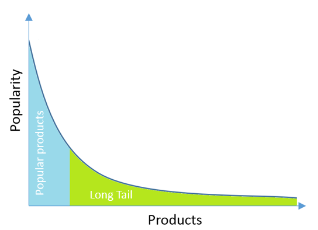

# 1. 推荐系统简介 

## 1.1 推荐系统的意义与价值

### 1.1.1 为什么要学推荐系统
- 利用推荐系统可以解决实际应用难题
- 使得平台、用户、供应商等多方收益

### 1.1.2 发展背景
- 互联网技术迅猛发展->信息爆炸->信息超载
- 互联网上的物品普遍存在**长尾**(long tail)现象

### 1.1.3 推荐系统
- 一种主动的**信息过滤**系统
  - 将信息过滤过程由"用户主动搜索"转变为"系统主动推送"
- 一种个性化的**双边匹配**系统
  - 帮助用户发现其所**喜好的或所需**的小众、非主流的商品
  - 帮助用户将其**商品展现**在对它们感兴趣的用户面前

### 1.1.4 推荐系统的价值
- 从**平台**的角度
  - 帮助其提高用户的满意度和忠诚度，同时给其带来丰厚的收益
- 从**用户**的角度
  - 帮助其解决信息超载的问题，提高其决策效率，提升其辛福感
- 从**供应商**的角度
  - 帮助其进行精准的商品推销，提高销售量，降低营销成本
- 从**行业**的角度
  - 帮助其更加多元化、健康的发展，帮助尾部商家得意生存和发展

## 1.2 推荐系统的历史与框架

### 1.2.1 推荐系统的发展历史
- 1992：Xerox公司开发出基于协同过滤的内部新闻组文档推荐系统Tapestry
- 1994：MIT和明尼苏达大学推出基于协同过滤的跨网络新闻推荐GroupLens
- 1998：Amazon推出基于项目的协同过滤算法，实现个性化的线上商品推荐
- 2003：Google开创AdWords盈利模式，根据用户搜索关键词推荐相关广告
- 2007：Google为AdWords添加了个性化元素
- 2006~2009：Netflix主办百万美金大奖赛，将其电影推荐准确率提高10%
- 个性化推荐在音乐，求职等诸多领域得到了成果的应用，并慢慢成为了各种互联网应用的一种标配

### 1.2.2 个性化推荐系统框架